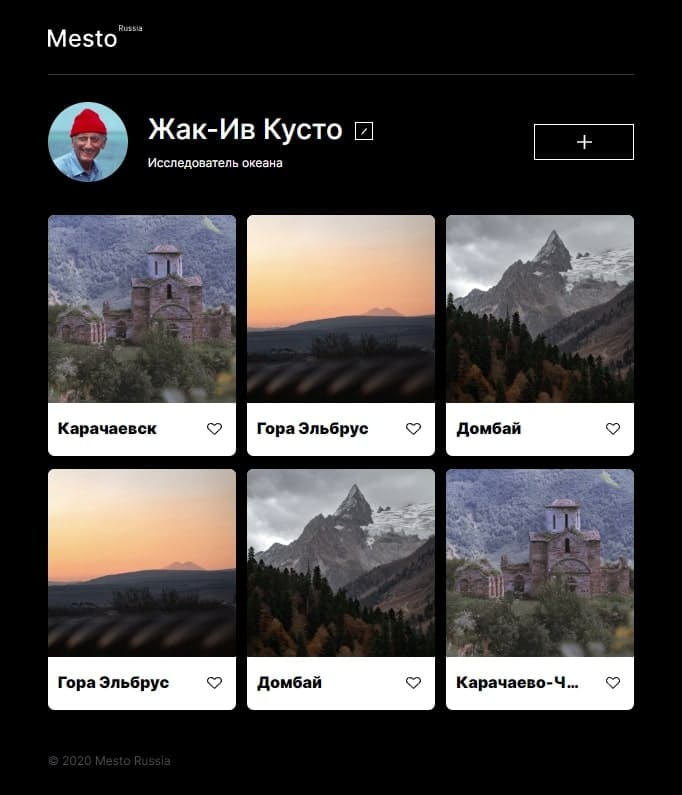

# Проект: Путешествие по России

<p align="center">

<!--  -->
</p>

## Проектная работа Яндекс Практикум - Адаптивная верстка

[Ссылка на GitHub pages](https://sergeyromadin.github.io/)

```
В этом проекте использованы основные технологии применяющиеся в верстке:
* HTML
* CSS
* БЭМ

```

**Figma**

- [Ссылка на макет в Figma](https://www.figma.com/file/2cn9N9jSkmxD84oJik7xL7/JavaScript.-Sprint-4?node-id=0%3A1)

### Глазков Сергей Сергеевич
